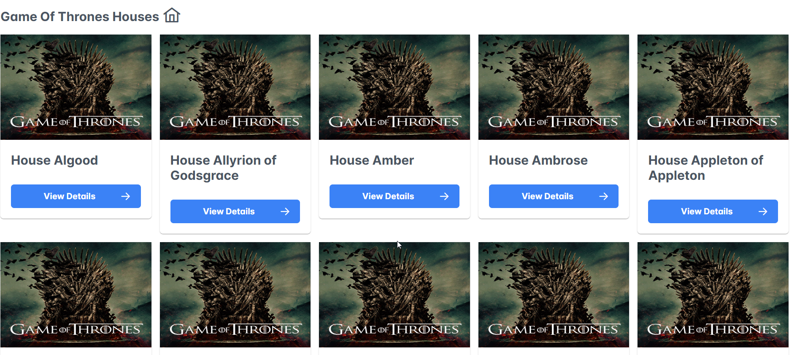
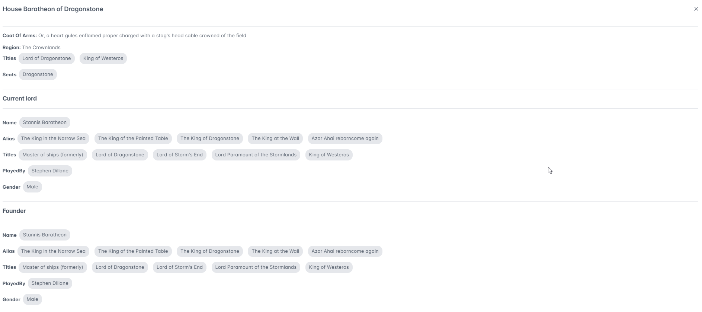

# GOT

This project was generated with [Angular CLI](https://github.com/angular/angular-cli) version 17.3.8.

## Development server

Run `ng serve` for a dev server. Navigate to `http://localhost:4200/`. The application will automatically reload if you change any of the source files.

## House Display

- Used cards to display list of houses for easy interaction
  

- Skeleton loader added to indicate the user about loading of houses

- Used pagination for loading data lazily for better performance
  

- Data will be cached for unwanted API calls to happen

## House Details View

- Details page will display full house information and related characters
  
- Character API calls are cached for better performance
### Note
I had some issue with Git in my office laptop, unfortunately can't able to preserve the history
